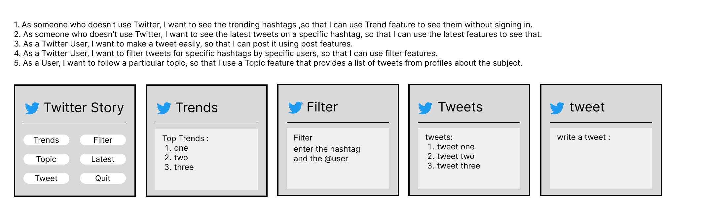

# Software Requirements
 
## Vision
 
The vision of our app is to scrapping the list of top trending hashtags on Twitter and visualize the analytics of them to show the most interactive ones 
that help people who's dosent use twitter to take the most important and general ,latest, trending news ,so we provide this services to help certain class 
of people to know the most important thing occupy public opinion in easily and simply way.
 
## Scope (In/Out)
 
- IN    - The web app will get trending hashtags on twitter (web scraping).
        - The web app will get tweets by user and hashtags.
        - Users will be able post tweets using python.
        - The web app will Analyzing user's interactions (hashtags) based on region + minimum number of likes on a tweet
        - The web app will User information, such as name, Twitter handle (username), location, follower/following count, profile URL/image/banner, date of creation.
        - The web app will List of tweets, retweets, and replies from profiles.
        
- OUT - The app won't show any private information about twitter users , just we maybe show puplic information that users have chosen to share with the world.
 
### Minimum Viable Product vs
 
we will need some product like 
-Twitter API
-Jupyter notebook
-python libraries (Tweepy, pandas, requests…. etc)
-GitHub

### Stretch
 
Our strech goal to provide more and more features from Twitter app and allowed user to make additionl things.
 
 
## Functional Requirements
 
List the functionality of your product. This will consist of tasks such as the following:
 
1. A user can List of tweets, retweets, and replies depends on spacific profiles.
2. A user can seee the User information, such as name, Twitter handle (username), location, follower/following count, profile URL/image/banner, date of creation 
depending on Tweet.
3.A user can Analyzing user's interactions (hashtags) based on region + minimum number of likes on a tweet.
4.A user can read trending hashtags, tweets by user and hashtags 
5.A user can post tweet on Twitter
 
### Data Flow
 
 First, the user will enter our app, then he will see several dialogs each offering a certain service, some of them need to press button to show Information ,
 other one You need to type inside the box a bit to get information or do something based on it as shown below: 
 
 
 
## Non-Functional Requirements (301 & 401 only)
 
1. Security : Maintain the privacy and security of information of users that use our app and any account on twitter.
1. Usability : we are carful to make our app user friendly and non much required to reach information.

The security was already exist because the twitter doesnt allowed to access private data of users,and from our side we wont show any information that can be sensitive of twitter user even if it accessable ,and we wont implement any function that show or share sensitive information of our app users.

Recarding to usability we are careful to discribe everything that user need to dealing with our app to help him use in very quick and easily way.
whichs make our project be testable for testability.

 
